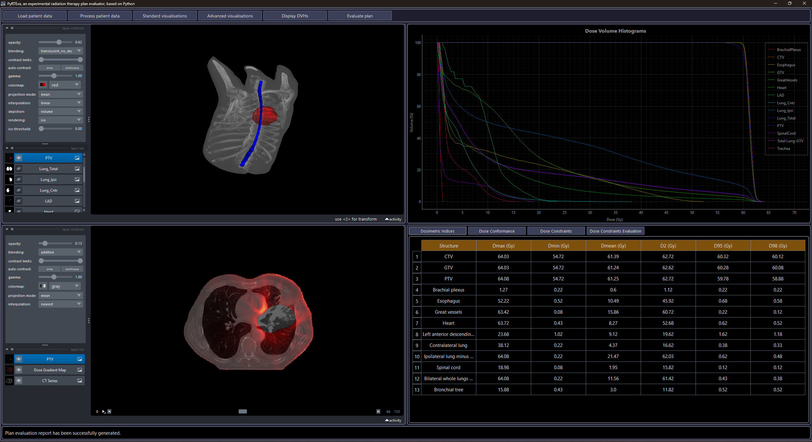
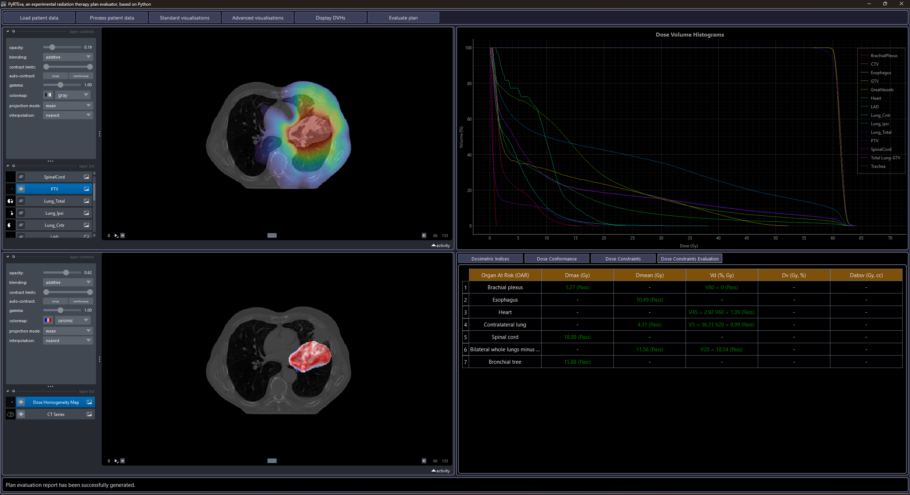
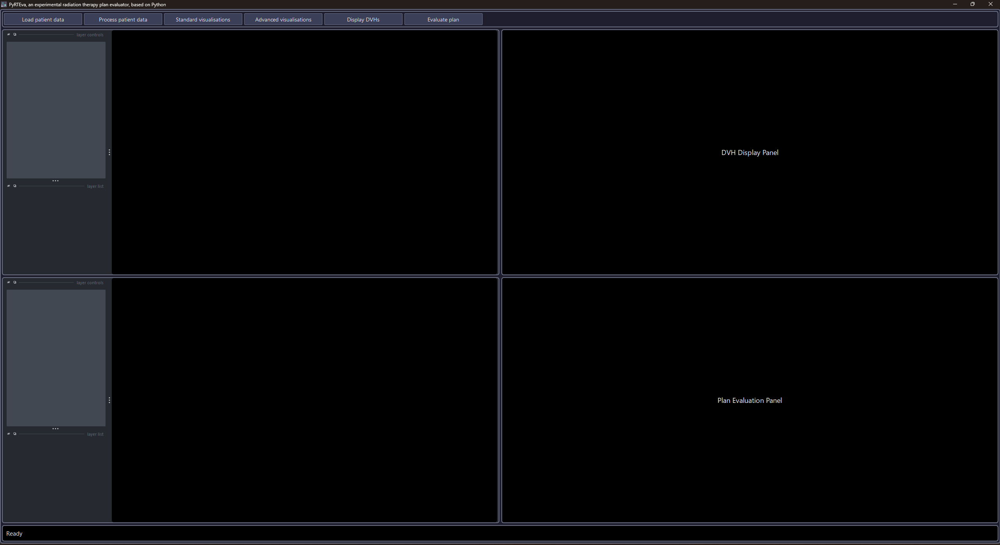

# PyRTEva

PyRTEva is a Python-based toolkit designed to automate the evaluation of radiotherapy treatment plans, focusing on both target coverage and sparing of critical structures (OARs). The toolkit allows users to import DICOM RT data, explore anatomy and dose distributions both in 2D and 3D, compute common plan quality metrics, and automatically evaluate dose constraints based on clinical guidelines (RTOG, QUANTEC).

## Features

- DICOM RT support. 
- Interactive 2D and 3D visualization including advanced options such as dose homogeneity and dose gradient mode.
- DVH computation with support for common dose metrics (Dmax, Dmean, Dx, Vx).
- Computation of standard plan evaluation metrics, including dose conformity index and dose homogeneity index.
- Automatic evaluation of dose constraints based on established guidelines (RTOG, QUANTEC), with clear reporting and highlighting of violations.
- Modern, lightweight Qt-based GUI, integrating visualization, DVH analysis, and dose constraints evaluation.

## Screenshots

##  Demo

## Source Code

The full implementation of PyRTEva is maintained in a private GitHub repository.
Access to the complete codebase can be provided upon request.

## Limitations

- While the toolkit supports core DICOM RT objects (CT, RTSTRUCT, RTDOSE, RTPLAN), it does not yet handle all vendor-specific edge cases, private tags, or uncommon acquisition geometries.

- Dose maps computation relies on the assumption of a rectangular dose grid that is spatially aligned with the patient’s coordinate system. In addition, it is assumed that the dose grid planes are fully or partially aligned with the slices of the CT series, along the z-axis. Non-rectangular grids, rotated grids, or grids that are not z-axis aligned (fully or partially) with the CT series are not currently supported.

- 2D Standard visualization mode supports only axial view. Sagittal and coronal views are not currently supported, although 3D volume rendering is available (3D Standard visualization mode).

- Automatic dose constraints evaluation is implemented only for treatment plans corresponding to lung cancer (conventional fractionation). Future development will extend coverage to additional body sites and fractionation schemes.

- The GUI is implemented using QtPy and incorporates multiple Napari viewers for standard and advanced visualization modes. Due to current limitations in signal handling between viewers, some interactive controls are temporarily disabled to prevent conflicting states. Furthermore, to maintain consistent display of content, certain panels are recreated rather than updated in place. Finally, evaluating multiple treatment plans currently requires restarting the GUI. These design choices ensure reliable functionality, while future updates will enhance state management and interactivity.

- Unit tests for core numerical computations have been included, although validation against commercial TPS outputs or large multi-institutional datasets has not yet been performed.

## References

- Aerts, H. J. W. L., Wee, L., Rios Velazquez, E., Leijenaar, R. T. H., Parmar, C., Grossmann, P., Carvalho, S., Bussink, J., Monshouwer, R., Haibe-Kains, B., Rietveld, D., Hoebers, F., Rietbergen, M. M., Leemans, C. R., Dekker, A., Quackenbush, J., Gillies, R. J., Lambin, P. (2014). Data From NSCLC-Radiomics (version 4) [Data set]. The Cancer Imaging Archive. [DOI](https://doi.org/10.7937/K9/TCIA.2015.PF0M9REI)

- Grégoire, V., & Mackie, T. R. (2011). State of the art on dose prescription, reporting and recording in Intensity-Modulated Radiation Therapy (ICRU report No. 83). Cancer/radiothérapie, 15(6-7), 555-559. [DOI](https://doi.org/10.1016/j.canrad.2011.04.003)

- Lomax, N. J., & Scheib, S. G. (2003). Quantifying the degree of conformity in radiosurgery treatment planning. International Journal of Radiation Oncology* Biology* Physics, 55(5), 1409-1419. [DOI](https://doi.org/10.1016/S0360-3016(02)04599-6)

- Van't Riet, A., Mak, A. C., Moerland, M. A., Elders, L. H., & Van Der Zee, W. (1997). A conformation number to quantify the degree of conformality in brachytherapy and external beam irradiation: application to the prostate. International Journal of Radiation Oncology* Biology* Physics, 37(3), 731-736. [DOI](https://doi.org/10.1016/s0360-3016(96)00601-3)

- Baltas, D., Kolotas, C., Geramani, K., Mould, R. F., Ioannidis, G., Kekchidi, M., & Zamboglou, N. (1998). A conformal index (COIN) to evaluate implant quality and dose specification in brachytherapy. International journal of radiation oncology, biology, physics, 40(2), 515-524. [DOI](https://doi.org/10.1016/s0360-3016(97)00732-3)

- Paddick, I., & Lippitz, B. (2006). A simple dose gradient measurement tool to complement the conformity index. Journal of neurosurgery, 105(Supplement), 194-201. [DOI](https://doi.org/10.3171/sup.2006.105.7.194)

- Marks, L. B., Yorke, E. D., Jackson, A., Ten Haken, R. K., Constine, L. S., Eisbruch, A., ... & Deasy, J. O. (2010). Use of normal tissue complication probability models in the clinic. International Journal of Radiation Oncology* Biology* Physics, 76(3), S10-S19. [DOI](https://doi.org/10.1016/j.ijrobp.2009.07.1754)

## Authors

Panagiotis Marentakis  

## License

This project is licensed under the Apache License, Version 2.0. See the LICENSE and NOTICE files for details.

## Disclaimer

This software is provided for research and educational purposes only.
It has not been validated for clinical use and must not be used during treatment planning or clinical decision-making.